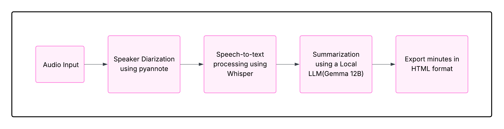

# Meeting Minutes Generator

This project automatically generates meeting minutes and an interactive transcript from an audio recording of a meeting.

## Workflow

1.  **Audio Input**: Takes an audio file (e.g., downloaded from a YouTube link) as input.
2.  **Speaker Diarization**: Uses `pyannote.audio` to identify different speakers and their speaking segments.
3.  **Speech-to-Text**: Transcribes the audio using OpenAI's `Whisper` model, associating text with the identified speakers.
4.  **Summarization**: Utilizes a local Large Language Model (LLM), here I used Gemma 12B accessed via `lmstudio`, to summarize the transcript into meeting minutes, focusing on agenda, key points, decisions, and action items.
5.  **Export**: Generates an HTML file containing the summarized meeting minutes and an interactive transcript where clicking timestamps seeks the corresponding position in the embedded video player.

## Dependencies

The project relies on several Python libraries:

*   `torch`: Required by `pyannote.audio` and `whisper`.
*   `pyannote.audio`: For speaker diarization.
*   `openai-whisper`: For speech-to-text transcription.
*   `yt-dlp`: For downloading audio from YouTube.
*   `pydub`: For audio manipulation (trimming, adding silence).
*   `webvtt-py`: For parsing VTT caption files.
*   `lmstudio`: For interacting with a local LLM server (like LM Studio).
*   `ipykernel`, `ipywidgets`, `ipython`: For running in a Jupyter Notebook environment.

You will need an read authentication token from Hugging Face (`HF_AUTH_TOKEN`) for `pyannote.audio`.

## Usage

1.  **Set up Environment**: Install the required dependencies, potentially within a conda environment.
2.  **Configure LM Studio**: Ensure you have LM Studio running with the Gemma 12B model (or a compatible model) loaded and the local server started.
3.  **Run Notebook**: Execute the cells in the [meeting_minutes.ipynb](meeting_minutes.ipynb) notebook sequentially.
    *   The notebook will download the audio, process it, perform diarization and transcription, summarize the content, and generate the final output.
4.  **View Output**: The generated meeting minutes and interactive transcript will be saved in `results/meeting.html`. Other intermediate files like `results/audio.wav`, `results/diarization.txt`, `results/transcript.txt`, etc., will also be created in the `results/` directory.

## Links
[OpenAI Whisper](https://github.com/openai/whisper?tab=readme-ov-filehttps://github.com/openai/whisper?tab=readme-ov-file)
[Pyannote Speaker Diarization](https://huggingface.co/pyannote/speaker-diarization)
[LM Studio Api](https://lmstudio.ai/docs/app/api)
[PyData Meeting](https://www.youtube.com/watch?v=6dZBTtwF2-s)
